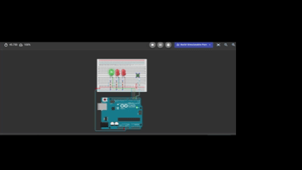

# LED-Steuerung mit einem Taster

> Die grüne LED leuchtet dauerhaft, solange der Taster nicht gedrückt wird. Beim Drücken des Tasters wird die grüne LED ausgeschaltet und die beiden roten LEDs blinken abwechselnd.

## Funktionsweise

Das Projekt verwendet einen Taster als digitalen Eingang und drei LEDs als digitale Ausgänge.

- Ist der Taster nicht gedrückt, leuchtet die grüne LED.
- Wird der Taster gedrückt, erlischt die grüne LED.
- Die beiden roten LEDs leuchten anschließend abwechselnd.
- Zwischen jedem Wechsel liegt eine Pause von 250 Millisekunden.

## Pinbelegung

| Arduino-Pin | Funktion |
|-------------|----------|
| `D2` | Taster |
| `D3` | Grüne LED |
| `D4` | Erste rote LED |
| `D5` | Zweite rote LED |

## Code

```cpp
int switchState = 0;
void setup() {
  // put your setup code here, to run once:
  pinMode(3, OUTPUT);
  pinMode(4, OUTPUT);
  pinMode(5, OUTPUT);
  pinMode(2, INPUT);
}

void loop() {
  // put your main code here, to run repeatedly:
  switchState = digitalRead(2);

  if(switchState == LOW)
  {
    digitalWrite(3, HIGH);
    digitalWrite(4, LOW);
    digitalWrite(5, LOW);
  }
  else
  {
    digitalWrite(3, LOW);
    digitalWrite(4, LOW);
    digitalWrite(5, HIGH);

    delay(250); 

    digitalWrite(5, LOW);
    digitalWrite(4, HIGH);

    delay(250); 
  }
}

```

## Schaltplan:


## Bespiel: 
