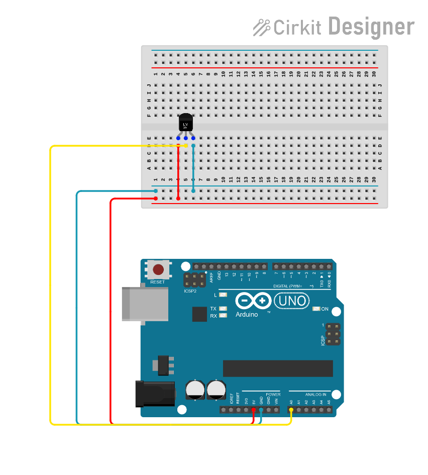
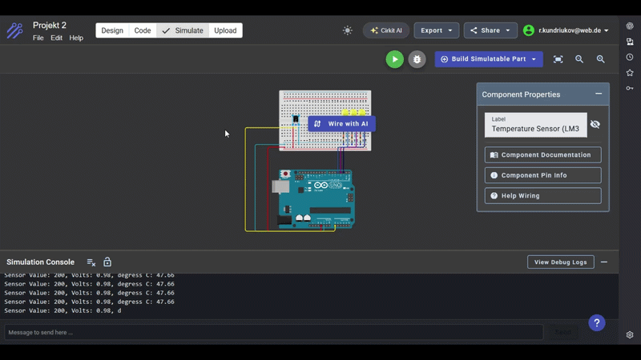

# Temperaturanzeige mit Arduino

> Die LEDs reagieren auf die vom Temperatursensor gemessene Temperatur. Je höher die Temperatur im Vergleich zur Basistemperatur von 20 °C ist, desto mehr LEDs leuchten.

## Funktionsweise

| Gemessene Temperatur | Zustand der LEDs |
|----------------------|------------------|
| Unter 22 °C | Alle LEDs sind ausgeschaltet |
| Ab 22 °C | Eine LED leuchtet |
| Ab 24 °C | Zwei LEDs leuchten |
| Ab 26 °C | Drei LEDs leuchten |

## Code

```cpp
const int sensorPin = A0;
const float baselineTemp = 20.0;

void setup() 
{
  Serial.begin(9600);

  for(int pinNumber = 2; pinNumber < 5; pinNumber++)
  {
    pinMode(pinNumber, OUTPUT);
    digitalWrite(pinNumber, LOW);
  }
}

void loop() 
{
  int sensorVal = analogRead(sensorPin);

  Serial.print("Sensor Value: ");
  Serial.print(sensorVal);

  float voltage = (sensorVal/1024.0) * 5.0;

  Serial.print(", Volts: ");
  Serial.print(voltage);

  Serial.print(", degress C: ");
  float temperature = (voltage - .5) * 100;
  Serial.println(temperature);

  if(temperature < baselineTemp + 2)
  {
    digitalWrite(2, LOW);
    digitalWrite(3, LOW);
    digitalWrite(4, LOW);
  }
  else if(temperature >= baselineTemp + 2 && temperature < baselineTemp + 4)
  {
    digitalWrite(2, HIGH);
    digitalWrite(3, HIGH);
    digitalWrite(4, LOW);
  }
  else if(temperature >= baselineTemp + 6)
  {
    digitalWrite(2, HIGH);
    digitalWrite(3, HIGH);
    digitalWrite(4, HIGH);
  }

  delay(1);
}

```

## Schaltplan:



## Beispiel:



